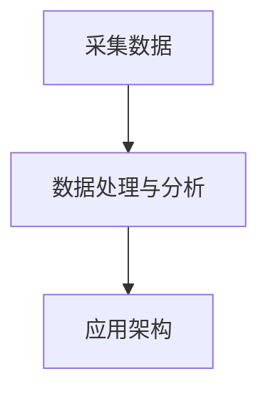

# DanceSignal开源平台

# Who we are？

<aside>
💡 首先声明我们没有任何组织，团队也尚在搭建，只是基于学校整体的改革方向-**智慧康养**-来进行一个项目实践。

</aside>

- 拟选题依据及研究目的

        情绪是人类行为中非常重要的一种心理状态，对人们的认知、决策、交往等方面都产生着深远的影响。在学习过程中，情绪也会对学生的学习效果和学习体验产生显著的影响。因此，通过有效的情绪识别可以更好地理解学生的学习状态和心理需求，通过数据分析可以归纳学生的心理健康状态，进而推进学生的心理健康工作。
        该研究的目的是探索基于生理信号分析的情绪识别方法，实现对学生情绪状态的准确、客观识别。具体而言，研究可以用来设计针对不同情绪状态下的学生提供不同的心理健康服务，以及提供情绪管理帮助，使学生更好地适应学习环境，并提高学习成效。同时，该研究还可以为人机交互领域的情感计算和情感识别技术提供理论和实践支持，促进相关技术的发展和应用。

- 拟研究方向及重点内容

        基于生理信号分析的学生情绪识别研究的主要研究方向是如何利用生物传感器和数据分析技术来识别学生的情绪状态。其重点内容包括以下几个方面：
        1.生物传感器的选择和使用：研究需要确定合适的生物传感器，并探索如何将它们应用于情绪识别中，比如心率传感器、皮肤电传感器等。（学院已有智能手表可以采集PPG,ECG等原始数据）
        2.生理信号的特征提取和分析：对于采集到的生理信号数据，需要进行特征提取和分析，以得出与情绪状态相关的特征指标，比如心率变异性、皮肤电反应等。
        3.情绪识别算法的设计和优化：基于提取到的特征指标，需要设计和优化情绪识别算法，以实现准确、客观地识别学生的情绪状态。常见的算法包括以SVM为代表的机器学习分类算法和前沿深度学习算法。
        4.情绪识别结果的应用和评价：针对不同情绪状态下的不同教学策略和资源进行设计和推荐；提供情绪管理帮助，使学生更好地适应学习环境，并提高学习成效；评价情绪识别算法的准确率和可靠性等。
        总之，该研究旨在实现对学生情绪状态的准确、客观识别，进而提高教育教学的智能化水平，推进学生心理健康工作。为人机交互领域的情感计算和情感识别技术提供理论和实践支持。

# What we do？

<aside>
💡 首先要意识到，真正伴随你的是你的能力提升，而不是你获得的荣誉（包括：论文，比赛，软著等），如果你只是蹭了这些项目而没有深度的参与或者说你获奖了但是没有含金量都是在你简历里的一行字，并没有事实意义。一旦你掌握了能力，成果只是你顺便转化的过程。我们的目标是告诉你什么样的学习是最接近产业化的，以及你做的工作在产业化的哪个环节。

</aside>

## 正式开始讲解一下我们现阶段的想法：

[流程图](DanceSignal%E5%BC%80%E6%BA%90%E5%B9%B3%E5%8F%B0%20e9286a2f686b4413a8eec295c9046a8a/%E6%B5%81%E7%A8%8B%E5%9B%BE%203926608ee4c34664a1a33f19de0b275b.md)

DanceSingal开源项目旨在创建一个平台，为用户提供一个集中的位置来管理他们的医疗需求。

该项目将由两大部分组成。

- **基于生理信号分析用户状态（客观）**

- 通过硬件手表采集生理数据（如ECG,PPG），进行数据的存储并做简单的信号处理

- 对采集上来的数据进行数据训练（如通过生理指标进行人的情绪识别）

- 通过前端可视化界面动态展示个人生理指标，并形成生理数据分析报告。
- **基于主观问题进行智能分诊（主观）**

- 对用户描述症状的预料库进行训练

- 通过类似智能客服的功能对用户描述的症状进行诊断。

###用户流量

1.用户将下载手机应用程序或访问网络应用程序以创建帐户并登录。

2.通过仪表板，用户可以访问各种功能，如安排预约、查看检测结果和联系医疗保健提供者。

3.用户还可以设置药物、预约和其他与健康相关的活动的提醒。

4.如果用户需要联系他们的医疗保健提供者，他们可以使用消息功能直接向他们的提供者发送安全消息。

5.提供商可以对消息做出响应，并向用户提供反馈或建议。

6.用户还可以查看自己的健康史，并跟踪血压、体重和血糖水平等指标。

7.后端服务器将安全地存储所有用户数据，并提供对授权医疗保健提供商的访问。

###开发流程

1.开发团队将首先创建线框和原型，以测试用户流并收集反馈。

2.一旦原型得到完善，团队将开始同时开发移动应用程序和网络应用程序。

3.后端服务器将与应用程序并行开发，以确保无缝集成。

4.该团队将进行广泛的测试，以确保平台安全且用户友好。

5.测试完成后，该平台将作为开源软件发布，允许其他人为其开发和改进做出贡献。

# How can you join us？

- [ ]  熟悉信号采集过程（将手表的原始数据发送到云端，同步到本地电脑）
- [ ]  利用Python对采集上来的信号进行处理，能够提取出一些指标，如：心率，血氧饱和度，血压
- [ ]  利用Python将处理后的数据进行训练，做简单的分类问题，如：看一个人的生理指标来判断这个人的情绪是低落还是高涨，精神压力大或者小等等。
- [ ]  利用Python将用户描述症状的预料库进行训练，达到能通过描述症状判断一个人有什么疾病的趋向。
- [ ]  利用Python将训练好的模型和采集的原始数据部署到服务器端，设置类似智能客服的问答框回答主观问题，实现数据的可视化展示（初步后端：Django，前端：Vue，数据库：Spark）

[Vue学习路径](DanceSignal%E5%BC%80%E6%BA%90%E5%B9%B3%E5%8F%B0%20e9286a2f686b4413a8eec295c9046a8a/Vue%E5%AD%A6%E4%B9%A0%E8%B7%AF%E5%BE%84%206bf2c469a6a04fc4beed5093722eee27.md)

该文档介绍了DanceSignal开源平台的想法和流程，旨在为用户提供一个集中的位置来管理他们的医疗需求。该项目将由两大部分组成，基于生理信号分析用户状态和基于主观问题进行智能分诊。该平台将作为开源软件发布，允许其他人为其开发和改进做出贡献。

- Notion工具入门链接

[全世界在抄的软件，到底怎么用？Notion十分钟入门指南。_哔哩哔哩_bilibili](https://www.bilibili.com/video/BV1YT4y1Q7xx/?spm_id_from=333.788&vd_source=185a0017cca7a9e35222dbd839b5e55d)

[DanceSignal项目成员名单](DanceSignal%E5%BC%80%E6%BA%90%E5%B9%B3%E5%8F%B0%20e9286a2f686b4413a8eec295c9046a8a/DanceSignal%E9%A1%B9%E7%9B%AE%E6%88%90%E5%91%98%E5%90%8D%E5%8D%95%20dcbe199f9c624cbd835c9763239c0ab0.md)

[基于Chatgpt的AI工具](DanceSignal%E5%BC%80%E6%BA%90%E5%B9%B3%E5%8F%B0%20e9286a2f686b4413a8eec295c9046a8a/%E5%9F%BA%E4%BA%8EChatgpt%E7%9A%84AI%E5%B7%A5%E5%85%B7%202b5c5eee9faf4c02a97d637a9bf5d344.md)