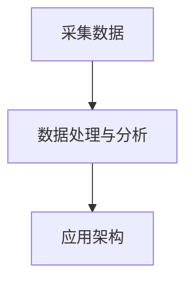

# DanceSignal开源平台

# Who we are？

<aside>
💡 首先声明我们没有任何组织，团队也尚在搭建，只是基于学校整体的改革方向-**智慧康养**-来进行一个项目实践。

</aside>

# What we do？

<aside>
💡 首先要意识到，真正伴随你的是你的能力提升，而不是你获得的荣誉（包括：论文，比赛，软著等），如果你只是蹭了这些项目而没有深度的参与或者说你获奖了但是没有含金量都是在你简历里的一行字，并没有事实意义。一旦你掌握了能力，成果只是你顺便转化的过程。我们的目标是告诉你什么样的学习是最接近产业化的，以及你做的工作在产业化的哪个环节。

</aside>

## 现阶段的想法：

[流程图](DanceSignal%E5%BC%80%E6%BA%90%E5%B9%B3%E5%8F%B0%20e9286a2f686b4413a8eec295c9046a8a/%E6%B5%81%E7%A8%8B%E5%9B%BE%203926608ee4c34664a1a33f19de0b275b.md)

DanceSingal开源项目旨在创建一个平台，为用户提供一个集中的位置来管理他们的医疗需求。

该项目将由两大部分组成。

- **基于生理信号分析用户状态（客观）**

- 通过硬件手表采集生理数据（如ECG,PPG），进行数据的存储并做简单的信号处理

- 对采集上来的数据进行数据训练（如通过生理指标进行人的情绪识别）

- 通过前端可视化界面动态展示个人生理指标，并形成生理数据分析报告。
- **基于主观问题进行智能分诊（主观）**

- 对用户描述症状的预料库进行训练

- 通过类似智能客服的功能对用户描述的症状进行诊断。

# How can you join us？

- [ ]  熟悉信号采集过程（将手表的原始数据发送到云端，同步到本地电脑）
- [ ]  利用Python对采集上来的信号进行处理，能够提取出一些指标，如：心率，血氧饱和度，血压
- [ ]  利用Python将处理后的数据进行训练，做简单的分类问题，如：看一个人的生理指标来判断这个人的情绪是低落还是高涨，精神压力大或者小等等。
- [ ]  利用Python将用户描述症状的预料库进行训练，达到能通过描述症状判断一个人有什么疾病的趋向。
- [ ]  利用Python将训练好的模型和采集的原始数据部署到服务器端，设置类似智能客服的问答框回答主观问题，实现数据的可视化展示（初步后端：Django，前端：Vue，数据库：Spark）

[Vue学习路径](DanceSignal%E5%BC%80%E6%BA%90%E5%B9%B3%E5%8F%B0%20e9286a2f686b4413a8eec295c9046a8a/Vue%E5%AD%A6%E4%B9%A0%E8%B7%AF%E5%BE%84%206bf2c469a6a04fc4beed5093722eee27.md)

该文档介绍了DanceSignal开源平台的想法和流程，旨在为用户提供一个集中的位置来管理他们的医疗需求。该项目将由两大部分组成，基于生理信号分析用户状态和基于主观问题进行智能分诊。该平台将作为开源软件发布，允许其他人为其开发和改进做出贡献。

- Notion工具入门链接

[全世界在抄的软件，到底怎么用？Notion十分钟入门指南。_哔哩哔哩_bilibili](https://www.bilibili.com/video/BV1YT4y1Q7xx/?spm_id_from=333.788&vd_source=185a0017cca7a9e35222dbd839b5e55d)

[DanceSignal项目成员名单](DanceSignal%E5%BC%80%E6%BA%90%E5%B9%B3%E5%8F%B0%20e9286a2f686b4413a8eec295c9046a8a/DanceSignal%E9%A1%B9%E7%9B%AE%E6%88%90%E5%91%98%E5%90%8D%E5%8D%95%20dcbe199f9c624cbd835c9763239c0ab0.md)